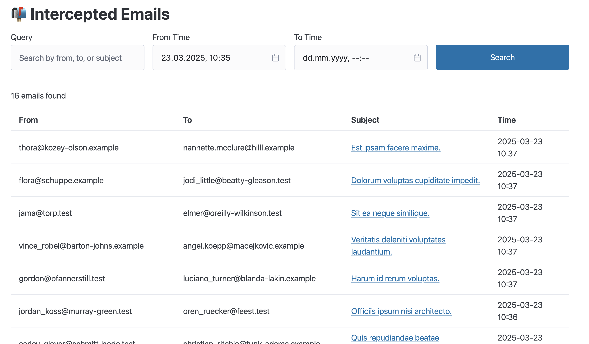
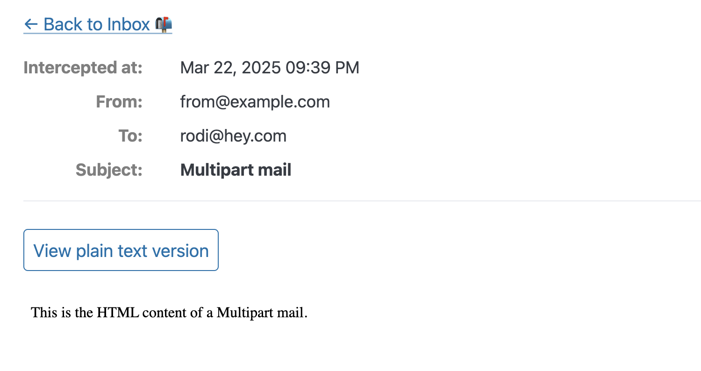

# LetterThief


**A Rails engine to log email deliveries, visualize them in the Browser and, if you want, intercept them.**

This gem allows you to log on the database the emails sent by your application.

It provides an interface to visualize the emails directly in the Browser, and search them.

You can of course navigate and search your emails using ActiveRecord `LetterThief::EmailMessage` model and integrate it
other parts of your app.

> List of interecepted email


> Email preview


You can also use `Letter Thief` as a delivery method in your application as well.

Set `config.action_mailer.delivery_method = :letter_thief` to stop sending emails and have them only logged in your
database. That's particularly useful in development environments or staging/pre-production environments as well.

If you used `letter_opener` in the past you know how nice it is to have
the sent emails opened automatically in your Browser when working locally.
LetterThief supports this as well with the very same mechanism, but `launchy` is not a direct dependency.
If you add Launchy on your Gemfile, emails will be opened right away once sent.

Since emails are persisted on the Database it means you can use this also on Heroku, deplo.io, or other PaaS where you
don't have a disk. No need for an external service like Mailtrap (amazing service!) anymore.

## Installation

Add this line to your application's Gemfile:

```ruby
gem "letter_thief"
```

And then execute:

```bash
bundle install
bin/rails generate letter_thief:install
bin/rails db:migrate
```

This will create the necessary tables.

If you want to stop sending emails, you can use it also as delivery method:

```ruby
config.action_mailer.delivery_method = :letter_thief
config.action_mailer.raise_delivery_errors = true
```

If you want emails to be opened immediately, add `launchy` to your Gemfile.

```ruby
group :development do
  gem "launchy"
end
```

and LetterThief will open emails directly in your Browser like Letter Opener.

### Separate database

If you'd like to store your emails on a separate database, you can configure it via:

`config.letter_thief.connects_to = {database: {writing: :letter_thief}}` and of course you'll need a separate database
configuration. Here is an example:

```yml
development:
  primary:
    <<: *default
    database: my_app_development
  letter_thief:
    <<: *default
    database: my_app_letter_thief_development
    migrations_paths: db/letter_thief_migrate
```

## Varia

> [!NOTE]
> Persisting the emails on the database might have privacy related concerns. You might want to encrypt stuff.

> [!NOTE]
> You might want to schedule a cleanup job to remove old records from time to time.

> [!NOTE]
> For this gem I was heavily inspired by letter_opener, which I used for over ten years. ❤️

> [!NOTE]
> I planned to basically just replicate letter_opener but persist emails in the database, so I could use it on Heroku or
> deplo.io, that's why is called LetterThief. It was supposed to just intercept and block emails from being sent. It
> ended up being this and also a logging system.

## Development

You can run the tests with `bin/test`. By default they run on sqlite. To run them on postgres or mysql, specify the
TARGET_DB.

```bash
bin/test #sqlite
TARGET_DB=postgres bin/test #postgres
TARGET_DB=mysql bin/test #mysql
```

## Contributing

Bug reports and pull requests are welcome on GitHub at https://github.com/coorasse/letter_thief.

Try to be a decent human being while interacting with other people.

## License

The gem is available as open source under the terms of the [MIT License](https://opensource.org/licenses/MIT).

